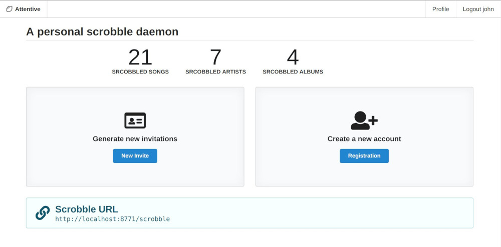

# Attentive

A personal scrobble daemon.

This project is a minimal scrobble server that can collect what songs
you are listening to. It's similiar to services like libre.fm or
last.fm, but without the social/community thing. The idea of attentive
is to be a simple and lightweight scrobble daemon that could run on a
raspberry pi or similiar devices at home.

## Features

- Store "now-playing" and "submissions" in a database.
- Support for multiple databases: MariaDB, PostgreSQL, SQLite and H2
- Web application to see your scrobbles and manage accounts

## Usage

You must have Java installed. There are ZIP files in the Releases
section. Unpack the file and change the configuration to your
needs. Then start the script in the `/bin` folder.

Configure your scrobble client to connect to the attentive server. The
scrobble url is at path `/scrobble`. So with the default
configuration, it would be `http://localhost:8771/scrobble`.

The webapp is then at `http://localhost:8771/app/index.html`.

You can browse the generated REST documentation at `http://localhost:8771/app/doc`.

For example, here is a config example for
[mpdscribble](https://github.com/MusicPlayerDaemon/mpdscribble):

```
[mpdscribble]
## The connection to MPDscribble
host = 192.168.100.12
port = 6600

[attentive]
url = http://localhost:8771/scrobble
username = john
password = john
journal = ./attentive.journal
```

## Screenshot



## Building

The build tool is [sbt](https://scala-sbt.org). Java 8 end Elm 0.19
are required. Then build it with this command:

```
sbt universal:packageBin
```

This creates a ZIP file in the `target/universal` folder.

## Configuration

You can pass an argument to the executable which will be used as the
configuration file. For details about the format, see [its
documentation](https://github.com/lightbend/config/blob/master/HOCON.md).
The default config is below.


### Default Configuration

```
attentive {
  # A name that is displayed in the web application.
  app-name = "Attentive"

  # The base url this app is deployed
  base-url = "http://localhost:8771"

  # A secret used to encrypt cookie data. If empty a random value is
  # generated at application start.
  server-secret = ""

  # The web server binds to this address.
  bind {
    host = "0.0.0.0"
    port = 8771
  }

  # Database settings
  jdbc {
    # The URL to the database. By default a file-based database is
    # used. It should also work with mariadb and postgresql.
    #
    # Examples:
    #    url = "jdbc:mariadb://192.168.1.172:3306/attentive"
    #    url = "jdbc:postgresql://localhost:5432/attentive"
    #    url = "jdbc:h2:./target/attentive.db"
    #    url = "jdbc:sqlite:./target/attentive-sqlite.db"
    url = "jdbc:h2:./target/attentive.db"

    # User and password for connecting to the database.
    user = "sa"
    password = ""

    # The driver class name.
    # - H2: org.h2.Driver
    # - MariaDB: org.mariadb.jdbc.Driver
    # - PostgreSQL: org.postgresql.Driver
    # - SQLite: org.sqlite.JDBC
    driver = "org.h2.Driver"
    poolsize = 10
  }

  auth {
    # The time a login token is valid
    token-valid = 3 minutes

    # The time a session cookie is valid
    session-valid = 6 hours
  }

  registration {
    # Registration of new accounts may be one of:
    # - open: Everybody can create new accounts.
    # - closed: No one can create new accounts; registration is disabled.
    # - invite: Registration is possible only with the correct invitation key.
    mode = "closed"

    # The "super" invitation password used to generate new invitations.
    # If empty, generating invitation keys is not possible.
    invitation-key = ""

    # How long a generated invitation key is valid.
    invitation-valid = 6 days
  }

  stats {
    # How long statistic values are cached. Longer times results in
    # less db queries but more stale values.
    cache-time = 3 minutes
  }
}
```
